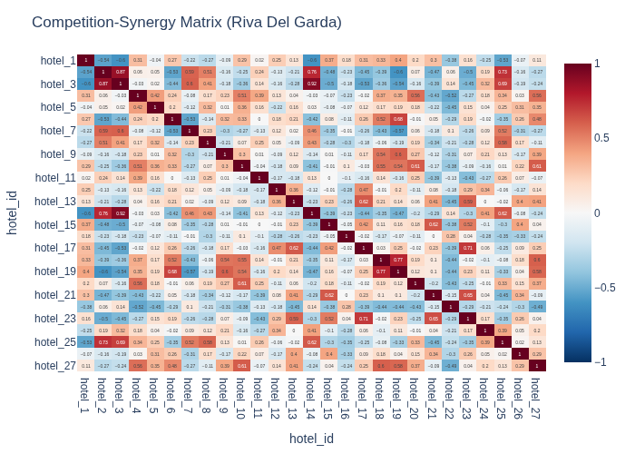
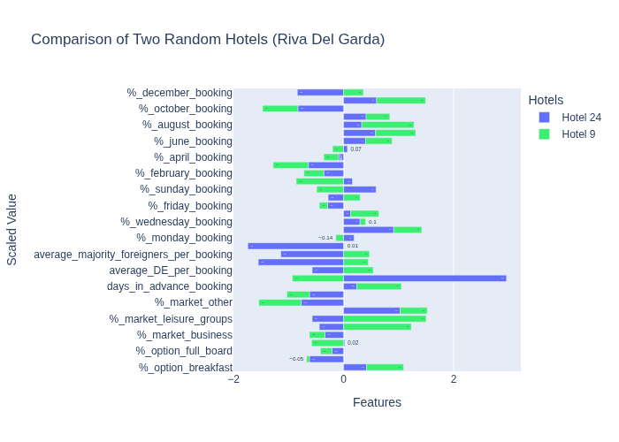
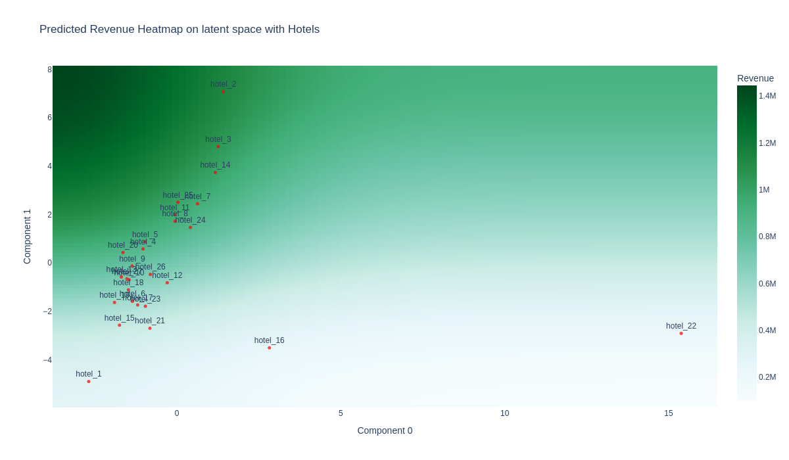

# Competition Synergy Analysis

A comprehensive analysis framework for understanding competitive dynamics and strategic positioning in the hospitality industry, with a focus on hotels in Riva Del Garda.
Hotel names are anonymized.

## Overview

This repository contains two complementary analytical approaches:

1. **Competition-Synergy Analysis**: Understanding competitive relationships between hotels
2. **Strategic Positioning Analysis**: Mapping optimal positioning strategies for revenue optimization

## Project Structure

```
Competition_Synergy/
├── data/
│   └── Riva_del_garda_hotels.csv     # Hotel dataset
├── output/
│   ├── competition_synergy/           # Competition analysis outputs
│   └── positioning/                   # Strategic positioning outputs
├── competition_synergy.ipynb          # Competition-synergy analysis
├── strategic_positioning.ipynb       # Strategic positioning analysis
└── README.md                         # This file
```

## Analyses

### 1. Competition-Synergy Analysis (`competition_synergy.ipynb`)

**Purpose**: Identify competitive relationships between hotels to understand market dynamics.

**Methodology**:
- Data preprocessing with StandardScaler normalization
- Spearman correlation analysis between hotels
- Visualization of competition-synergy matrices

**Key Outputs**:
- **Competition-Synergy Matrix**: Heatmap showing relationships between all hotels
- **Mean Competition-Synergy**: Bar chart of mean competitive value
- **Hotel Comparison**: Example of a Side-by-side analysis of selected hotels




**Insights**:
- Positive correlations indicate synergy (complementary positioning)
- Negative correlations suggest direct competition
- Identifies key features driving competitive dynamics

### 2. Strategic Positioning Analysis (`strategic_positioning.ipynb`)

**Purpose**: Map optimal strategic positions for revenue maximization using dimensionality reduction and predictive modeling.

**Methodology**:
- Principal Component Analysis (PCA) for dimensionality reduction (95% variance retained)
- RandomForest regression for revenue prediction
- Gaussian smoothing for strategic positioning heatmaps

**Key Outputs**:
- **PCA Scatter Plot**: Hotel positions in reduced strategic space (latent space)
- **Revenue Heatmap**: Predicted revenue across strategic positioning space
- **Component Analysis**: Feature contributions to strategic dimensions




**Insights**:
- Identifies high-revenue strategic positions ("green zones")
- Shows how hotels differentiate in strategic space
- Reveals which features drive strategic positioning

## Key Features

- **Standardized Data Processing**: Ensures fair comparison across different metrics
- **Interactive Visualizations**: Plotly-based charts for better exploration
- **Predictive Modeling**: Revenue optimization through strategic positioning
- **Component Interpretation**: Understanding what drives strategic differences

## Requirements

```python
pandas
numpy
plotly
scikit-learn
scipy
```

## Usage

1. **Competition Analysis**:
   ```bash
   jupyter notebook competition_synergy.ipynb
   ```

2. **Strategic Positioning**:
   ```bash
   jupyter notebook strategic_positioning.ipynb
   ```

## Data Requirements

The analysis expects a CSV file with hotel features including:
- Various hotel characteristics
- Revenue data (`tot_revenue_euro`) for strategic positioning
- Hotel identifiers as index

## Outputs

All visualizations are saved in the respective output folders:
- PNG images for static analysis
- HTML files for interactive exploration

## Applications

- **Hotel Management**: Understand competitive positioning and identify optimization opportunities
- **Market Analysis**: Assess competitive landscape and market gaps
- **Strategic Planning**: Data-driven positioning decisions for revenue growth
- **Investment Decisions**: Identify high-potential strategic positions

## Methodology Notes

- **Spearman Correlation**: Used for robust relationship detection regardless of data distribution
- **PCA**: Reduces complexity while preserving 95% of variance
- **Random Forest**: Captures non-linear relationships for revenue prediction
- **Gaussian Smoothing**: Creates interpretable strategic positioning zones

## Future Enhancements

- Multi-city comparative analysis
- Temporal analysis of positioning changes
- Clustering analysis for market segmentation
- Real-time competitive monitoring